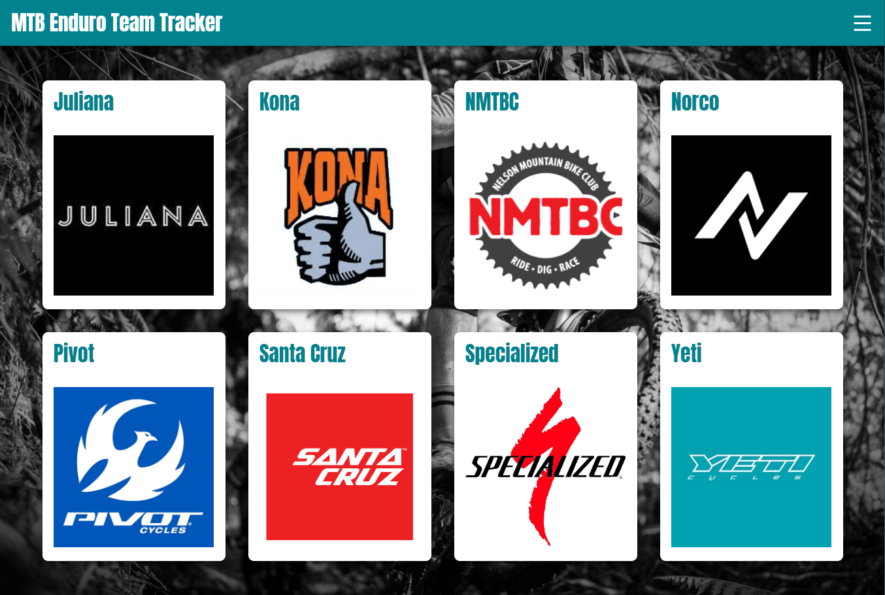
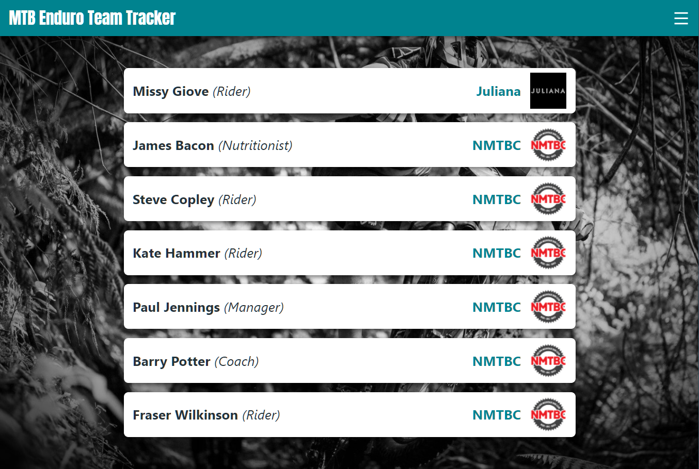
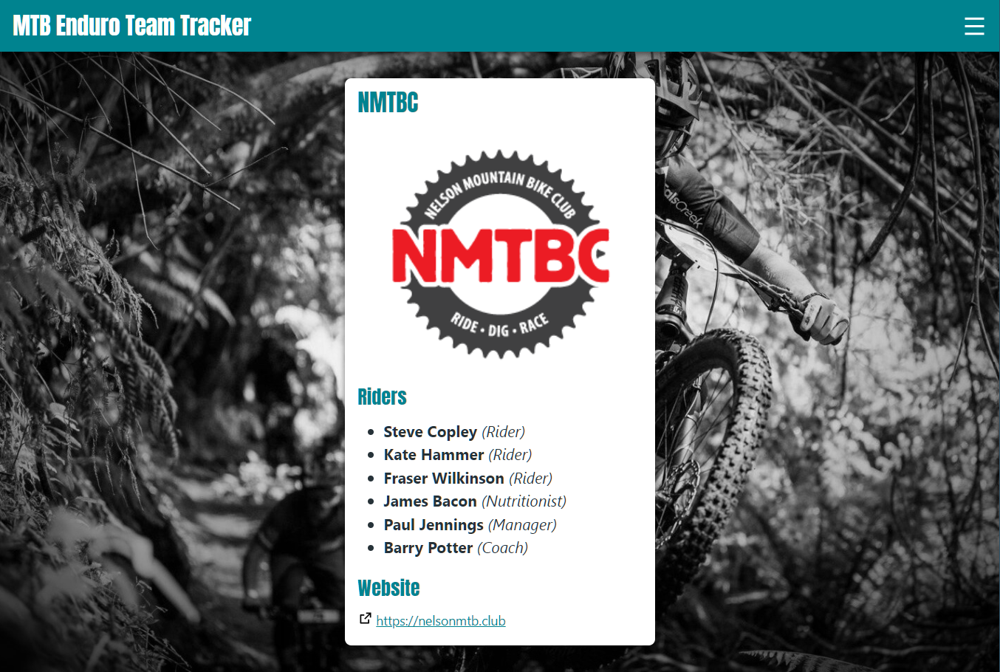
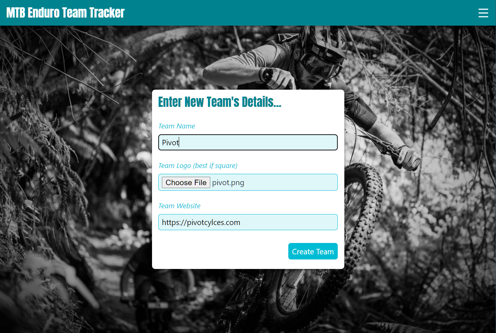
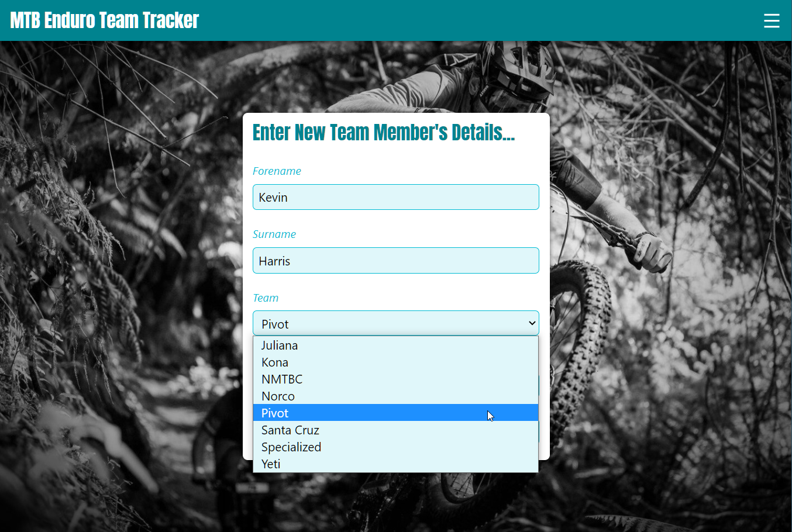
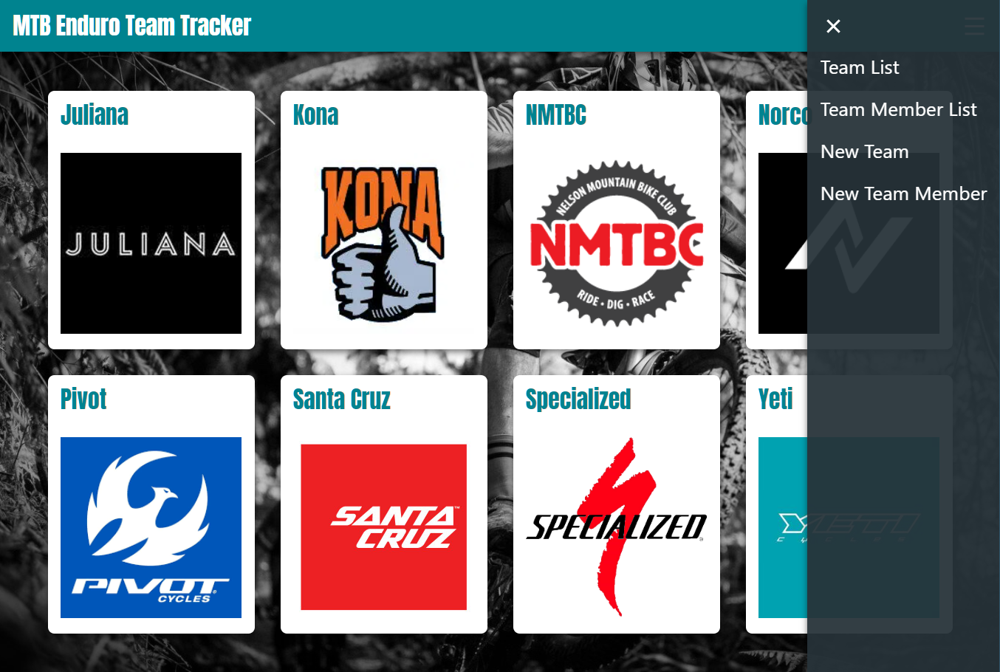

# Demo Project - Teams and Players Tracker

Demonstrates: 

- Some CRUD functionality:
   - Creation of new data
   - Reading of existing data
   - (No Updating of data)
   - (No Deletion of data)
- Relational DB queries
   - Queries from individual tables
   - Queries with JOINs from both
- Uploading and storing of images
   - Stored in a server folder (write permissions required)
   - URL only stored in DB

Site has a simple but responsive UI, including:
- mobile-first design
- lists of teams / members
- expanded team details view
- pop-in menu

## Screenshots

Team List

Members List

Team Details View

New Team

New Member

Menu

